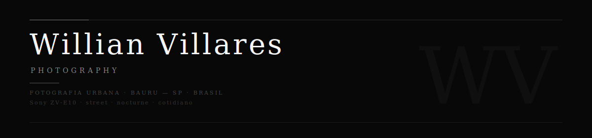

<div align="center">



<br>

[](https://wvillares-photography.vercel.app)
&nbsp;
[](https://www.instagram.com/wvillares.photos/)
&nbsp;
[](mailto:will.vills.ds.sants@hotmail.com)

</div>

<br>

---

<br>

> *A cidade como ela e de verdade.*

Encontro nas ruas a minha maior inspiracao. Cada clique e uma tentativa de registrar o que passa despercebido na pressa do dia a dia.

Becos, fachadas, cenas noturnas, silhuetas contra a luz, reflexos no asfalto molhado. A camera nao como instrumento de registro, mas de leitura da cidade.

<br>

---

<br>

### Equipamento e Estilo

| | |
|---|---|
| Camera | Sony ZV-E10 |
| Lente | 16-50mm f/3.5-5.6 OSS |
| Base | Bauru, SP, Brasil |
| Estilo | Street · Nocturne · Cotidiano · Arquitetura |

<br>

---

<br>

### O Site

Portfolio construido do zero — nenhum template, nenhum CMS, nenhum framework. HTML, CSS e JavaScript puros em arquivo unico, conectado a um backend real.

<br>

| Camada | Tecnologia |
|---|---|
| Frontend | HTML · CSS · JavaScript |
| Backend | Supabase — PostgreSQL + Storage |
| Hospedagem | Vercel |
| Tipografia | Cormorant Garamond · DM Sans |

<br>

**Lighthouse**

| Metrica | Desktop | Mobile |
|---|---|---|
| Performance | 98 / 100 | 89 / 100 |
| Acessibilidade | 100 / 100 | 100 / 100 |
| SEO | 100 / 100 | 100 / 100 |

<br>

---

<br>

### Sobre

De dia, analista de logistica — processos, fluxos e dados operacionais.

Nas horas livres, fotografo nas ruas e entusiasta de programacao e inteligencia artificial. Acredito que tecnologia e arte caminham juntas — este portfolio e a prova disso.

- Logistica e Processos
- Fotografia Urbana
- Desenvolvimento Web
- Inteligencia Artificial e Automacao

<br>

---

<br>

### Estrutura

```
/
├── index.html        site completo
├── vercel.json       deploy e headers de seguranca
├── og-image.png      preview para redes sociais
├── banner.svg        imagem do README
├── favicon.ico
└── README.md
```

<br>

---

<div align="center">
<br>
feito com camera na rua e codigo no terminal
<br><br>
</div>

---

<div align="center">
<br>

*Este projeto foi desenvolvido com auxilio de inteligencia artificial como parte de estudos e experimentos pessoais em desenvolvimento web. Todo o conteudo, conceito e direcao criativa sao autorais.*

<br>
</div>
